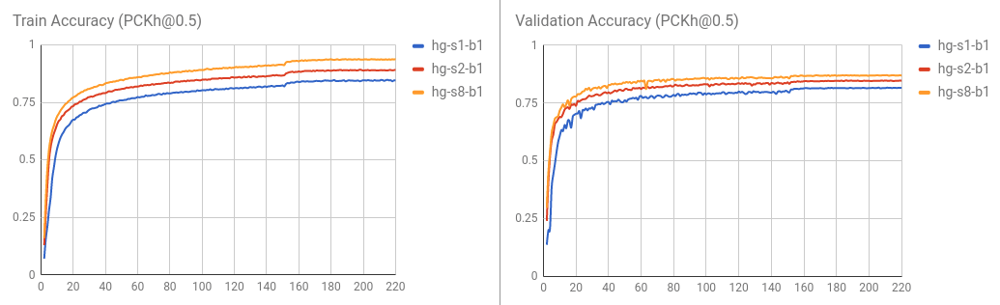

# Evaluation

You may download our pretrained models (e.g., [2-stack hourglass model](https://drive.google.com/drive/folders/0B63t5HSgY4SQQ2FBRE5rQ2EzbjQ?resourcekey=0-EyrDJs1JYnC5byj5GydbPQ&usp=sharing)) for a quick start.

Run the following command in terminal to evaluate the model on MPII validation split (The train/val split is from [Tompson et al. CVPR 2015](http://www.cims.nyu.edu/~tompson/data/mpii_valid_pred.zip)).
```
CUDA_VISIBLE_DEVICES=0 python example/main.py --dataset mpii -a hg --stacks 2 --blocks 1 --checkpoint checkpoint/mpii/hg_s2_b1 --resume checkpoint/mpii/hg_s2_b1/model_best.pth.tar -e -d
```
* `-a` specifies a network architecture
* `--resume` will load the weight from a specific model
* `-e` stands for evaluation only
* `-d` will visualize the network output. It can be also used during training

The result will be saved as a `.mat` file (`preds_valid.mat`), which is a `2958x16x2` matrix, in the folder specified by `--checkpoint`.

## Evaluate the PCKh@0.5 score

### Evaluate with MATLAB

You may use the matlab script `evaluation/eval_PCKh.m` to evaluate your predictions. The evaluation code is ported from  [Tompson et al. CVPR 2015](http://www.cims.nyu.edu/~tompson/data/mpii_valid_pred.zip).

The results (PCKh@0.5 score) trained using this code is reported in the following table.


| Model            | Head | Shoulder | Elbow | Wrist | Hip  | Knee  | Ankle | Mean |
| ---------------- | -----| -------- | ----- | ----- | ---- | ------|------ | ---- |
| hg_s2_b1 (last)  | 95.80| 94.57    | 88.12 | 83.31 | 86.24| 80.88 | 77.44 | 86.76|
| hg_s2_b1 (best)  | 95.87| 94.68    | 88.27 | 83.64 | 86.29| 81.20 | 77.70 | 86.95|
| hg_s8_b1 (last)  | 96.79| 95.19    | 90.08 | 85.32 | 87.48| 84.26 | 80.73 | 88.64|
| hg_s8_b1 (best)  | 96.79|	95.28	   | 90.27 | 85.56 | 87.57| 84.3  | 81.06	| 88.78|

Training / validation curve is visualized as follows.



### Evaluate with Python

You may also evaluate the result by running `python evaluation/eval_PCKh.py` to evaluate the predictions. It will produce exactly the same result as that of the MATLAB. Thanks [@sssruhan1](https://github.com/sssruhan1) for the [contribution](https://github.com/bearpaw/pytorch-pose/pull/2).