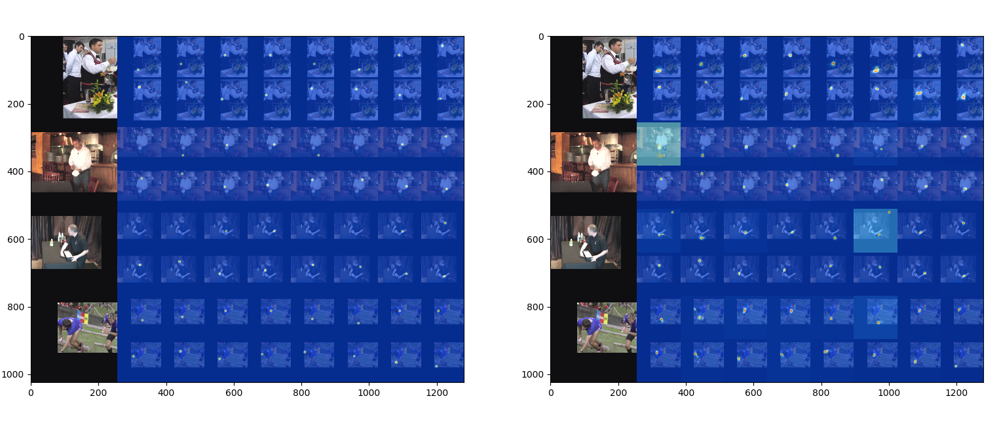

# Training

Run the following command in terminal to train an 8-stack of hourglass network on the MPII human pose dataset.
```
CUDA_VISIBLE_DEVICES=0 python example/main.py --dataset mpii -a hg --stacks 8 --blocks 1 --checkpoint checkpoint/mpii/hg8 -j 4
```
Here,
* `CUDA_VISIBLE_DEVICES=0` identifies the GPU devices you want to use. For example, use `CUDA_VISIBLE_DEVICES=0,1` if you want to use two GPUs with ID `0` and `1`.
* `-j` specifies how many workers you want to use for data loading.
* `--checkpoint` specifies where you want to save the models, the log and the predictions to.

## More Training Recipes

### Train from scratch - ECCV'16 8-stack hourglass network
```
CUDA_VISIBLE_DEVICES=0 python ./example/main.py \
--dataset mpii \
--arch hg \
--stack 8 \
--block 1 \
--features 256 \
--checkpoint ./checkpoint/mpii/hg-s8-b1
```

### Train a much faster version of HG (e.g., 1-stack)
```
CUDA_VISIBLE_DEVICES=0 python ./example/main.py \
--dataset mpii \
--arch hg \
--stack 1 \
--block 1 \
--features 256 \
--checkpoint ./checkpoint/mpii/hg-s1-b1
```

### Train on COCO 2014/2017 (set `--year` argument )
```
CUDA_VISIBLE_DEVICES=0 python ./example/main.py \
--dataset mscoco \
--year 2017 \
--arch hg \
--stack 1 \
--block 1 \
--features 256 \
--checkpoint ./checkpoint/mscoco/hg-s1-b1
```

### Resume training from a checkpoint
```
CUDA_VISIBLE_DEVICES=0 python ./example/main.py \
--dataset mpii \
--arch hg \
--stack 8 \
--block 1 \
--features 256 \
--checkpoint ./checkpoint/mpii/hg-s8-b1 \
--resume ./checkpoint/mpii/hg-s8-b1/checkpoint.pth.tar
```

### Simple baselines model (e.g., resnet50)
```
GPU=0
ARCH=pose_resnet
DSET=mpii
FEAT=256
TRAINB=32
VALB=24
LR=1e-3
WORKERS=8
RESNETLAYERS=50
SOLVER=adam

CHECKPOINT=./checkpoint/${DSET}/${ARCH}-${RESNETLAYERS}-${SOLVER}-lr${LR}

CUDA_VISIBLE_DEVICES=${GPU} python example/main.py \
--arch ${ARCH} \
--dataset ${DSET} \
--stack ${STACK} \
--block ${BLOCK} \
--features ${FEAT} \
--checkpoint ${CHECKPOINT} \
--train-batch ${TRAINB} \
--test-batch ${VALB} \
--lr ${LR} \
--workers ${WORKERS} \
--resnet-layers ${RESNETLAYERS} \
--solver ${SOLVER} \
--epochs 140 \
--schedule 90 120 \
--target-weight # original code uses this trick for training pose_resnet
```

### Other options
- **Evaluation** from an existing model: use `-e`
```
CUDA_VISIBLE_DEVICES=0 python ./example/main.py \
--dataset mpii \
--arch hg \
--stack 8 \
--block 1 \
--features 256 \
--checkpoint ./checkpoint/mpii/hg-s8-b1 \
--resume ./checkpoint/mpii/hg-s8-b1/checkpoint.pth.tar \
-e
```

- **Debug**: Use `-d` if you want to visualize the keypoints with images
```
CUDA_VISIBLE_DEVICES=0 python ./example/main.py \
--dataset mpii \
--arch hg \
--stack 1 \
--block 1 \
--features 256 \
--checkpoint ./checkpoint/mpii/hg-s1-b1 \
--resume ./checkpoint/mpii/hg-s1-b1/checkpoint.pth.tar \
-e \
-d
```

The visualized images should be like


